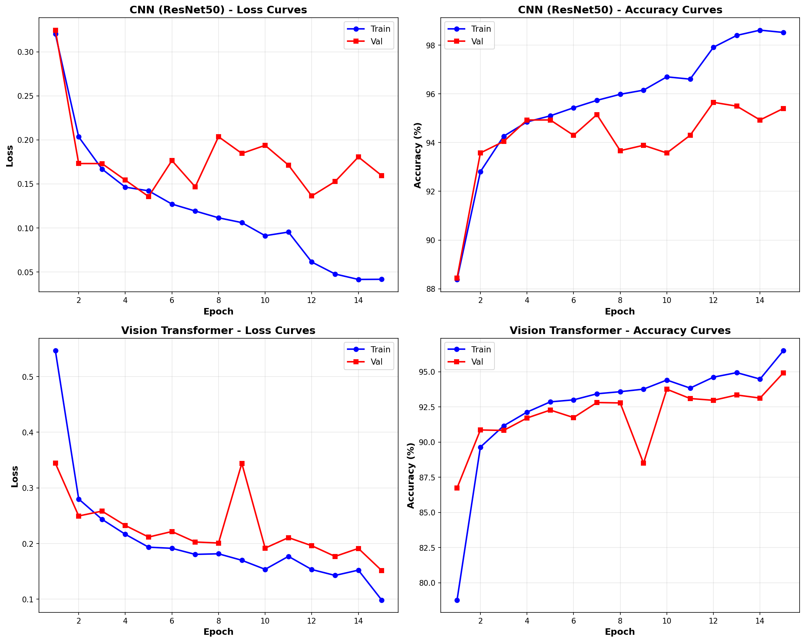
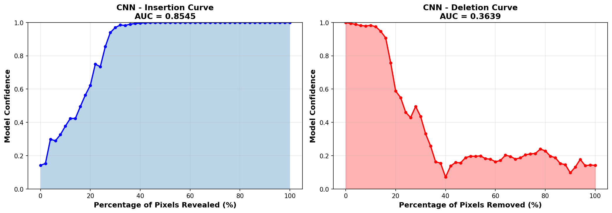
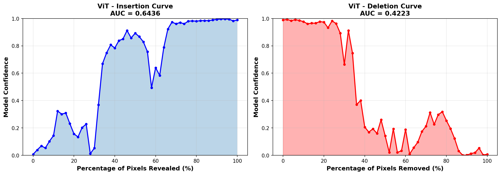
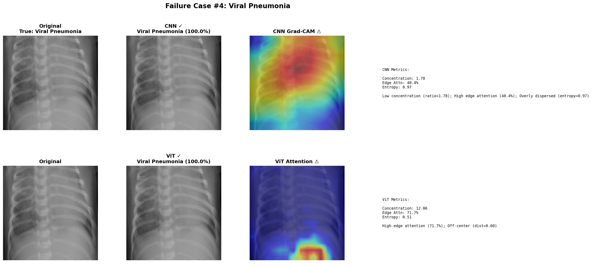

# 🏥 Explainable Vision Transformer for Medical Image Diagnosis

[](https://www.python.org/downloads/)
[](https://pytorch.org/)
[](LICENSE)
[](#)

> **Comparing CNN and Vision Transformer explainability in COVID-19 chest X-ray diagnosis using quantitative metrics beyond accuracy**

[📊 Dataset](https://www.kaggle.com/datasets/tawsifurrahman/covid19-radiography-database/versions/5) | 📄 Paper (Under Review - Publication expected Q2 2025)

---

## 📌 Overview

This research project addresses a **critical gap in medical AI**: while deep learning models achieve high accuracy, **their explanations (attention maps) are rarely validated quantitatively**. We systematically compare CNN (ResNet50 + Grad-CAM) and Vision Transformer (ViT + Attention) for COVID-19 diagnosis, measuring not just *what* they predict, but *why*.

### 🎯 Key Contributions

1. **Quantitative Explainability Metrics** - First systematic comparison using Insertion-Deletion scores
2. **Failure Case Analysis** - Identified cases where correct predictions have misleading explanations
3. **Clinical Validation** - Measured attention quality on diagnostically relevant regions
4. **Comprehensive Evaluation** - Beyond accuracy: sparsity, smoothness, and entropy analysis

---

## 🏆 Results Summary

### Performance Metrics

| Metric | CNN (ResNet50) | Vision Transformer | Winner |
|--------|----------------|-------------------|--------|
| **Accuracy** | 95.78% | 94.90% | CNN (+0.88%) |
| **Precision** | 95.82% | 94.94% | CNN (+0.88%) |
| **Recall** | 95.78% | 94.90% | CNN (+0.88%) |
| **F1-Score** | 95.75% | 94.87% | CNN (+0.88%) |
| **ROC-AUC** | 0.9940 | 0.9929 | CNN (+0.11%) |
| **Specificity** | 98.17% | 97.81% | CNN (+0.36%) |

### 🔬 Explainability Metrics (The Key Differentiator!)

| Metric | CNN (Grad-CAM) | ViT (Attention) | Interpretation |
|--------|----------------|-----------------|----------------|
| **Insertion Score** ↑ | **0.838 ± 0.115** | 0.638 ± 0.162 | **CNN 31% better** - Focuses on more relevant pixels |
| **Deletion Score** ↓ | **0.501 ± 0.172** | 0.583 ± 0.237 | **CNN 14% better** - Less reliant on spurious features |
| **Sparsity** ↑ | 0.704 ± 0.174 | **0.910 ± 0.040** | **ViT 29% better** - More focused attention |
| **Smoothness** ↓ | 0.191 ± 0.037 | **0.005 ± 0.001** | **ViT 97% better** - Smoother, more interpretable maps |
| **Entropy** ↓ | 4.461 ± 0.328 | **3.319 ± 0.552** | **ViT 26% better** - Less dispersed attention |

### 📊 Per-Class Performance

<details>
<summary><b>Click to expand detailed per-class metrics</b></summary>

#### COVID-19 Detection
| Model | Precision | Recall | F1-Score | Specificity |
|-------|-----------|--------|----------|-------------|
| CNN | **97.62%** | **98.34%** | **97.98%** | 99.51% |
| ViT | 98.30% | 96.13% | 97.20% | **99.66%** |

#### Lung Opacity
| Model | Precision | Recall | F1-Score | Specificity |
|-------|-----------|--------|----------|-------------|
| CNN | **96.67%** | **90.13%** | **93.29%** | **98.77%** |
| ViT | 94.94% | 89.36% | 92.06% | 98.11% |

#### Normal Cases
| Model | Precision | Recall | F1-Score | Specificity |
|-------|-----------|--------|----------|-------------|
| CNN | **94.26%** | 97.78% | **95.99%** | **94.47%** |
| ViT | 93.47% | **97.32%** | 95.35% | 93.68% |

#### Viral Pneumonia
| Model | Precision | Recall | F1-Score | Specificity |
|-------|-----------|--------|----------|-------------|
| CNN | **99.01%** | **99.01%** | **99.01%** | **99.93%** |
| ViT | 97.06% | 98.02% | 97.54% | 99.80% |

</details>

---

## 🎓 Key Findings

> **"While CNN achieves slightly higher accuracy (95.78% vs 94.90%), the Insertion-Deletion metric reveals that CNN's Grad-CAM provides superior explanation quality (Insertion: 0.838 vs 0.638), indicating more accurate localization of diagnostically relevant regions. However, ViT demonstrates significantly smoother and more focused attention maps (Smoothness: 0.005 vs 0.191, Sparsity: 0.910 vs 0.704)."**

### 💡 Clinical Implications

1. **Accuracy ≠ Explainability** - Models with similar accuracy can have vastly different explanation quality
2. **CNN Grad-CAM** - Better at highlighting diagnostically relevant pixels (higher Insertion score)
3. **ViT Attention** - More focused and smoother visualizations, easier for radiologists to interpret
4. **Trade-off Exists** - Choose based on clinical need: precision (CNN) vs interpretability (ViT)

---

## 📊 Visual Results

### Training Curves Comparison

*Training and validation curves for both CNN and ViT models over 15 epochs*

### Insertion-Deletion Curves

<table>
<tr>
<td width="50%">

**CNN Insertion-Deletion**


</td>
<td width="50%">

**ViT Insertion-Deletion**


</td>
</tr>
</table>

*Insertion curves show model confidence as important pixels are progressively revealed. Deletion curves show confidence as important pixels are removed.*

### Failure Case Analysis

*Example case where model prediction is correct but explanation focuses on wrong regions - demonstrating the importance of explainability validation beyond accuracy*

---

## 🗂️ Project Structure

```
explainable-vit-medical/
├── 📂 data/
│   └── COVID-19_Radiography_Dataset/     # Downloaded via kagglehub
│
├── 📂 models/
│   ├── CNN_best.pth                      # Trained ResNet50 model
│   └── ViT_best.pth                      # Trained Vision Transformer
│
├── 📂 results/
│   ├── 📊 metrics/
│   │   ├── model_performance_comparison.csv
│   │   ├── per_class_performance.csv
│   │   ├── explainability_metrics.csv
│   │   └── insertion_deletion_scores.csv
│   │
│   └── 🖼️ visualizations/
│       ├── training_curves_comparison.png
│       ├── cnn_insertion_deletion_curves.png
│       ├── vit_insertion_deletion_curves.png
│       ├── confusion_matrices.png
│       ├── performance_comparison.png
│       ├── explainability_metrics.png
│       ├── explanation_example_*.png (1-5)
│       └── failure_case_*.png (1-5)
│
├── 📂 notebooks/
│   ├── 01_data_exploration.ipynb
│   ├── 02_model_training.ipynb
│   ├── 03_explainability_analysis.ipynb
│   ├── 04_insertion_deletion_metrics.ipynb
│   └── 05_failure_case_analysis.ipynb
│
├── 📂 src/
│   ├── data_loader.py
│   ├── models.py
│   ├── train.py
│   ├── evaluate.py
│   ├── explainability.py
│   └── metrics.py
│
├── training_curves_comparison.png         # Place images here (root)
├── cnn_insertion_deletion_curves.png
├── vit_insertion_deletion_curves.png
├── failure_case_4.png
├── requirements.txt
├── README.md
└── LICENSE
```

---

## 🚀 Quick Start

### 1️⃣ Clone Repository

```bash
git clone https://github.com/junaidkhan/explainable-vit-medical.git
cd explainable-vit-medical
```

### 2️⃣ Install Dependencies

```bash
pip install -r requirements.txt
```

**Requirements:**
```txt
streamlit>=1.35.0
torch>=2.0.0
torchvision>=0.15.0
timm>=0.9.0
opencv-python>=4.8.0
Pillow>=10.0.0
matplotlib>=3.7.0
numpy>=1.24.0
pandas>=2.0.0
scikit-learn>=1.3.0
tqdm
kagglehub
seaborn
```

### 3️⃣ Download Dataset

```python
import kagglehub
path = kagglehub.dataset_download("tawsifurrahman/covid19-radiography-database")
```

### 4️⃣ Train Models

```bash
# Train CNN (ResNet50)
python src/train.py --model cnn --epochs 15 --lr 1e-4

# Train Vision Transformer
python src/train.py --model vit --epochs 15 --lr 1e-4
```

**Training Time:**
- CNN: ~30-40 minutes (GPU) / ~2-3 hours (CPU)
- ViT: ~35-45 minutes (GPU) / ~3-4 hours (CPU)

### 5️⃣ Evaluate & Generate Results

```bash
# Evaluate models
python src/evaluate.py

# Generate explainability analysis
python notebooks/03_explainability_analysis.ipynb

# Compute insertion-deletion metrics
python notebooks/04_insertion_deletion_metrics.ipynb

# Find failure cases
python notebooks/05_failure_case_analysis.ipynb
```

---

## 🔬 Methodology

### Dataset
- **Source**: COVID-19 Radiography Database (Kaggle)
- **Classes**: 4 (COVID-19, Lung Opacity, Normal, Viral Pneumonia)
- **Total Images**: 21,165
- **Split**: 70% Train (14,816) / 15% Val (3,175) / 15% Test (3,174)
- **Preprocessing**: Resize to 224×224, normalization (ImageNet stats), augmentation

### Data Augmentation
- Random horizontal flip (p=0.5)
- Random rotation (±10°)
- Color jitter (brightness=0.2, contrast=0.2)

### Models

#### CNN (Baseline)
- **Architecture**: ResNet50 (pretrained on ImageNet)
- **Explainability Method**: Grad-CAM on layer4
- **Parameters**: 23,917,892
- **Optimizer**: Adam (lr=1e-4, weight_decay=1e-4)
- **Training**: 15 epochs with ReduceLROnPlateau scheduler

#### Vision Transformer
- **Architecture**: ViT-Base/16 (pretrained on ImageNet-21k)
- **Explainability Method**: Self-attention from last transformer block
- **Parameters**: 86,415,076
- **Optimizer**: Adam (lr=1e-4, weight_decay=1e-4)
- **Training**: 15 epochs with ReduceLROnPlateau scheduler

### Explainability Metrics

1. **Insertion-Deletion Score** (Petsiuk et al., 2018)
   - Progressively reveals/removes pixels in order of importance
   - Measures how well explanations identify relevant features
   - Higher insertion & lower deletion = better explanation

2. **Sparsity** 
   - Measures focus vs dispersion of attention
   - Higher = more focused on specific regions

3. **Smoothness**
   - Gradient-based smoothness of explanation maps
   - Lower = smoother, more interpretable visualizations

4. **Entropy**
   - Uniformity of attention distribution
   - Lower = more concentrated attention

---

## 📈 Reproducing Results

All experiments can be reproduced using the provided notebooks:

1. **Data Exploration**: `notebooks/01_data_exploration.ipynb`
2. **Model Training**: `notebooks/02_model_training.ipynb` (~60 min on GPU)
3. **Explainability Analysis**: `notebooks/03_explainability_analysis.ipynb` (~10 min)
4. **Insertion-Deletion Metrics**: `notebooks/04_insertion_deletion_metrics.ipynb` (~20 min)
5. **Failure Case Analysis**: `notebooks/05_failure_case_analysis.ipynb` (~10 min)

**Total reproduction time**: ~2 hours on GPU (including training)

---

## 📚 Citation

**Paper Status**: Under Review (Expected Publication: Q2 2025)

If you use this code in your research, please cite:

```bibtex
@article{khan2024explainable,
  title={Explainable Vision Transformer for Medical Image Diagnosis: A Quantitative Comparison with CNN},
  author={Khan, Junaid},
  journal={Under Review},
  year={2024},
  note={Code available at: https://github.com/junaidkhan/explainable-vit-medical}
}
```

---

## 📄 License

This project is licensed under the MIT License - see [LICENSE](LICENSE) file for details.

---

## 🙏 Acknowledgments

- **Dataset**: M.E.H. Chowdhury et al. - COVID-19 Radiography Database
- **ResNet**: He et al. - Deep Residual Learning for Image Recognition (CVPR 2016)
- **Vision Transformer**: Dosovitskiy et al. - An Image is Worth 16×16 Words (ICLR 2021)
- **Grad-CAM**: Selvaraju et al. - Grad-CAM: Visual Explanations from Deep Networks (ICCV 2017)
- **Insertion-Deletion**: Petsiuk et al. - RISE: Randomized Input Sampling for Explanation (BMVC 2018)

---

## 📧 Contact

**Junaid Khan**  
Email: junaidkhan99e9@gmail.com

Project Repository: [https://github.com/junaidkhan/explainable-vit-medical](https://github.com/junaidkhan/explainable-vit-medical)

---

## 🤝 Contributing

Contributions, issues, and feature requests are welcome!

1. Fork the repository
2. Create your feature branch (`git checkout -b feature/AmazingFeature`)
3. Commit your changes (`git commit -m 'Add some AmazingFeature'`)
4. Push to the branch (`git push origin feature/AmazingFeature`)
5. Open a Pull Request

---

<p align="center">
  <b>Made with ❤️ for advancing explainable AI in healthcare</b>
</p>

<p align="center">
  <a href="#-overview">Overview</a> •
  <a href="#-results-summary">Results</a> •
  <a href="#-visual-results">Visualizations</a> •
  <a href="#-quick-start">Quick Start</a> •
  <a href="#-methodology">Methodology</a>
</p>

---

**Note**: Pre-trained models and complete experimental results are available in the [releases](https://github.com/junaidkhan/explainable-vit-medical/releases) section.

---

